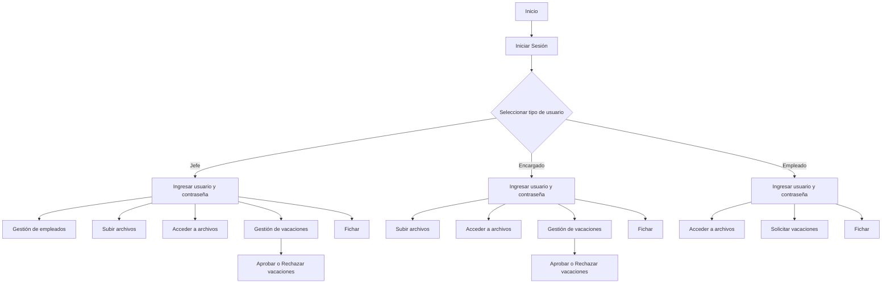
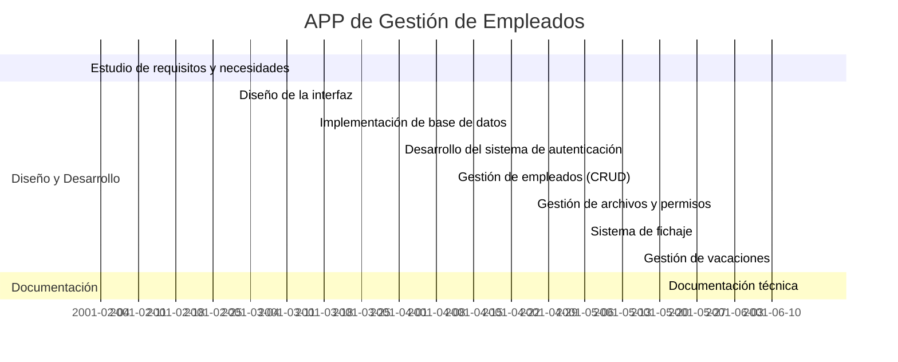
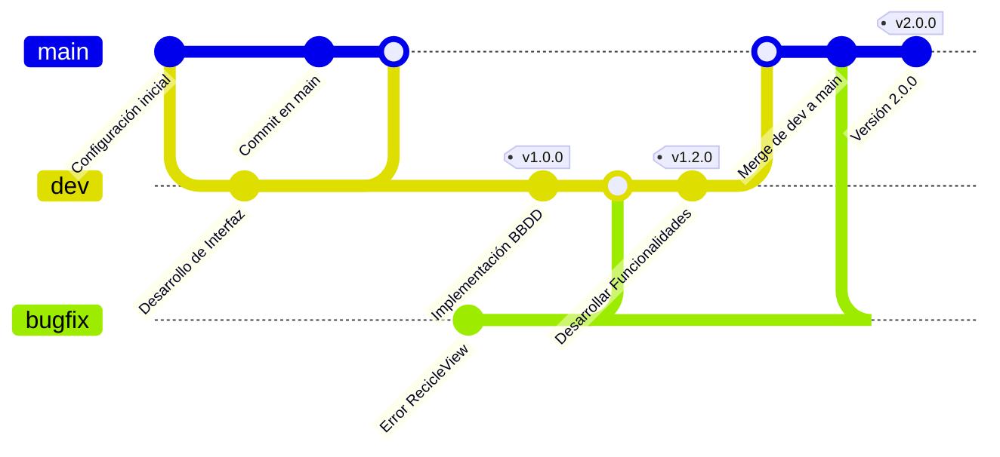
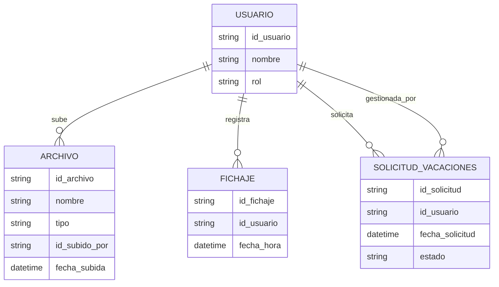
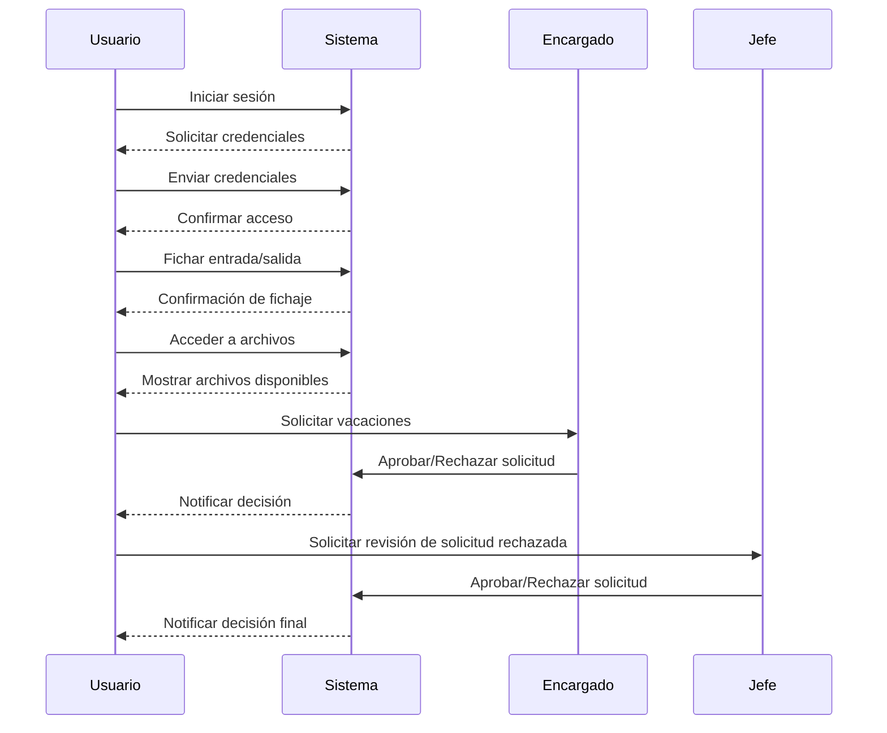
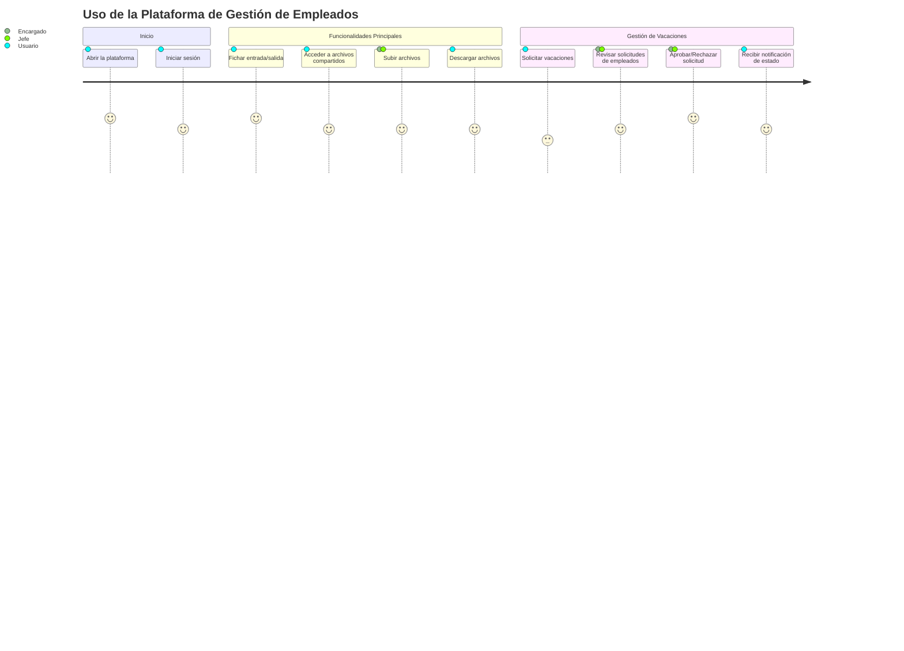

# 📱 App de Gestión de empleados

## 🧩 Introducción

En este proyecto, voy a desarrollar una aplicación móvil diseñada para mejorar el la gestión de los empleados y que sea mas simple la manera tanto de fichar como de solicitar vacaciones, como para gestionar para los jefes el tiempo que trabaja cada empleado.

---

## 🎯 Objetivos

- 🏗 **Crear una interfaz accesible** basada en la optimización del espacio.
- 🎤 **Simplificar la gestion de empleados**, la organización de vacaciones y la de archivos .
- 📊 **Proporcionar herramientas para los trabajadores**, permitiéndoles gestionar el tiempo de trabajo, la gestión de vacaciones y tener una manera rapida de transferir archivos.

---

## 📌 Características Principales

✅ Interfaz sencilla e intuitiva. 
✅ Base de datos sincronizada para almacenar la información requerida. 
✅ Módulo administrativo exclusivo para administradores.  
✅ Informes y estadísticas del tiempo trabajado de los empleados.

---

## 📊 Tecnologías Utilizadas

| Tecnología | Uso |
|------------|-----|
|  | Desarrollo móvil |
|  | Lenguaje principal |
|  | Base de datos |
|  | Desarrollo Interfaz |

---

## 🔄 Flujo de la Aplicación

---

## 📆 Planificación (Diagrama Gantt)

---
## 🐙 Planificación (Diagrama Git)

---
## 📊 Diagrama de Entidad-Relación Provisional

---

## 📜 Diagrama de Secuencia Provisional

---

## 📜 Diagrama de Requerimientos

```mermaid
requirementDiagram
    requirement R1 {
        id: 1
        text: "La aplicación debe permitir a los usuarios iniciar sesión."
    }
    requirement R2 {
        id: 2
        text: "Los Administrador deben poder rechazar y aceptar vacaciones."
    }
    requirement R3 {
        id: 3
        text: "Los trabajadores pueden poder solicitar vacaciones."
    }
    requirement R4 {
        id: 4
        text: "El sistema debe registrar las acciones de los administradores/trabajadores/responsables."
    }
    requirement R5 {
        id: 5
        text: "Los trabajadores pueden descargar archivos de la plataforma."
    }
    requirement R6 {
        id: 6
        text: "Los administradores y encargados pueden subir/descargar archivos de la plataforma."
    }
    
    requirement R7 {
        id: 7
        text: "Los usuarios tienen que poder fichar y desfichar a las horas trabajadas."
    }
    requirement R8 {
        id: 8
        text: "Los Administradores/encargados tienen que poder obtener un informe de cada trabajador."
    }
```

---
## 📜 Diagrama de Journey

---

## 🤝 Contribuciones

¡Las contribuciones son bienvenidas! Para colaborar:

1. **Escribe tu propuesta** con aquello que has pensado.
2. **Envíalo por correo** al <eduardo@correo.com>.
3. **Nos pondremos en contacto** contigo si nos interesa tu propuesta.

---
